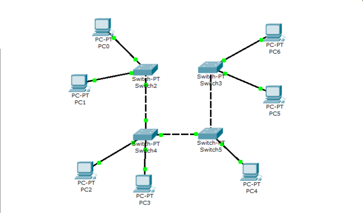

## Лабораторная работа №1 "Базовая настройка ip-телефонов в среде Сisco packet tracer"

### Описание
Для выполнения данной лабораторной работы собирается схема соединения. Необходимо проверить, правильно ли подключены и настроены все узлы устройств.

### Цель работы
Изучить рабочую среду Cisco Packet Tracer, ознакомить- ся с интерфейсами основных устройств, типами кабелей, научиться собирать топологию.

### Правила по оформлению
Правила по оформлению отчета по лабораторной работе вы можете изучить по [ссылке](../reportdesign.md)

### Ход работы

1. Изучить теоретическую и практическую части лабораторной работы.
2. Собрать схему соединения.
3. Научиться настраивать коммутаторы и компьютеры для полноценной работы сети.
4. Научиться применять основной список команд для конфигурирования устройств сети.
5. После выполнения необходимых настроек необходимо убедиться в том, что любой компьютер одной сети посредством пинга передает пакеты любому компьютеру другой сети.

### Результаты лабораторной работы
В результате лабораторной работы у вас должна получиться схема связи следующего вида:

-Результаты пингов

