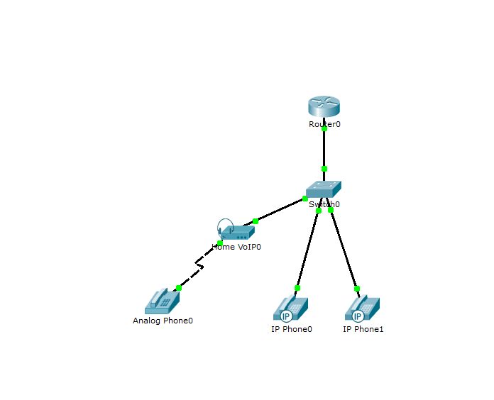
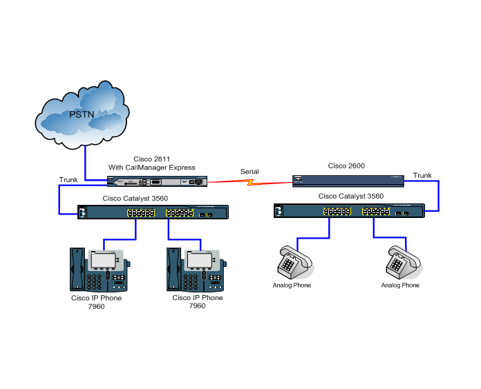

## Лабораторная работа №3 "Формирование класса ограничения звонков"

### Описание
Для выполнения данной лабораторной работы необходимо выпол- нить настройки предыдущих лабораторных работ.

### Цель работы
изучение класса ограничения в сети IP-телефонии. Применение класса ограничения звонков на внутренние и внешние номера.

### Правила по оформлению
Правила по оформлению отчета по лабораторной работе вы можете изучить по [ссылке](../reportdesign.md)

### Ход работы

#### Часть 1

1. Настроить маршрутизатор, коммутатор, IP-телефоны Cisco 7960 аналогично лабораторной работе №2. -
2. Настроить интерфейсы FXO и FXS.
3. Создать corlist (правила по звонкам) и применить правила к внутренним телефонам. бвт
4. Проверить входящие и исходящие звонки с правилами ограничения.
5. Проверить работают ли сервисы: перевод звонка, конференц-связь, перехват звонка.

#### Часть 2 

1. Настроить маршрутизатор Cisco 2811, коммутатор Cisco Cata- lyst 3560, IP-телефоны Cisco 7960 аналогично лабораторной работе №1.
2. Настроить интерфейсы FXO и FXS аналогично лабора- торной работе №2.
3. Создать corlist (правила по звонкам) и приме- нить правила к внутренним телефонам.
4. Проверить входящие и исходящие звонки с правилами ограничения.
5. Проверить работают ли сервисы: перевод звонка, конференц-связь, перехват звонка.
6. Настроить с наименьшим номером IP телефон, чтобы быть в состоянии назвать по глобальной сети, но не по ТфОП:
- настройка с наибольшим номером IP телефон, чтобы быть в состоянии позвонить в любую точку, что маршрутизатор может вызвать;
- проверить исходящие и входящие звонки аналогового теле- фона в локальную сеть и сеть PSTN;
- проверить ограничение звонков сети PSTN на аналоговый телефон.

### Результаты лабораторной работы
В результате лабораторной работы у вас должна получиться схемы связи следующего вида:

### Схема 1

### Схема 2

-Результаты пингов.

-Результаты звонков.

-Схема связи.