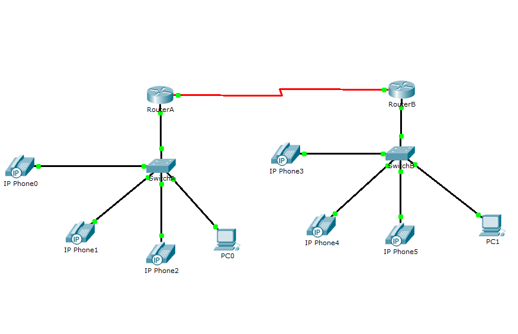
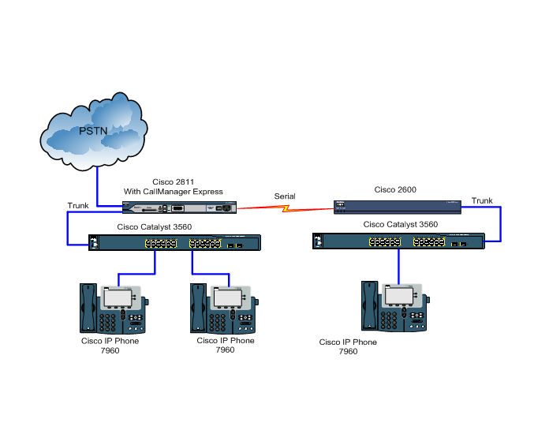

## Лабораторная работа №4 "Построение сети ip-телефонии между удаленными маршрутизаторами"

### Описание
Для выполнения данной лабораторной работы собирается схема соединения.Необходимо проверить, правильно ли подключены все узлы устройств.

### Цель работы
Изучить построение сети IP-телефонии между удаленными филиалами с помощью маршрутизаторов Cisco 2811 и коммутаторов Cisco 2950Т.Изучить построение сети IP-телефонии между удаленными филиалами с помощью маршрутизаторов Cisco 2811 и Cisco 2600XM.

### Правила по оформлению
Правила по оформлению отчета по лабораторной работе вы можете изучить по [ссылке](../reportdesign.md)

### Ход работы

#### Часть 1

1. Настройте интерфейс fa0/0 на маршрутизаторах Cisco 2811.
2. Настройте интерфейс s0/3/0 на маршрутизаторах Cisco 2811.
3. Настроить маршрутизатор Cisco 2811, коммутатор Cisco 3950Т, IP-телефоны аналогично лабораторной работе №2.
4. Настроить DHCP сервера на маршрутизаторах для передачи голо- са и данных между ними.
5. Настроить динамическую маршрутизацию RIP между маршрутизаторами для передачи информации друг другу.
6. Настроить услуги телефонии Cisco CallManager Express на маршрутизаторе 2811.
7. Командой switchport mode access сконфигурировать выбран- ные порты коммутатора, как порты доступа (аксесс порт). Командой switchport access vlan 1 указать, что данные порты является портом доступа для vlan с номером 1.
8. Проверить вызовы между удаленными IP-телефонами.

#### Часть 2 

1. Настроить маршрутизатор Cisco 2811, коммутатор Cisco Catalyst 3560, IP-телефоны Cisco 7960 аналогично лабораторной работе №1,2.
2. Настроить маршрутизатор Cisco 2600 и коммутатор Cisco Catalyst 3560, настроить между ними транковые порты.
3. Настроить между маршрутизаторами Cisco 2811 и Cisco 2600 маршрутизацию, соединенных между собой Serial интерфейсом.
4. Проверить вызовы между удаленными IP-телефонами. С удален- ного телефона необходимо выйти в сеть PSTN.
5. Проверить работают ли сервисы: перевод звонка, конференц-связь, перехват звонка.

### Результаты лабораторной работы
В результате лабораторной работы у вас должна получиться схемы связи следующего вида:

### Схема 1

### Схема 2

-Результаты пингов.

-Результаты звонков.

-Схема связи.